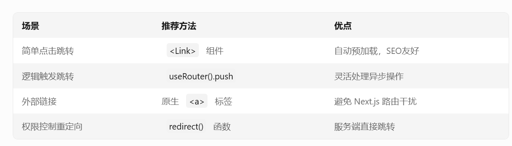

# registry-template

1. middleware 只负责保护 Next.js 应用内的路由，其他路由请求校验在api-client封装。

## Documentation

Visit the [shadcn documentation](https://ui.shadcn.com/docs/registry) to view the full documentation.

